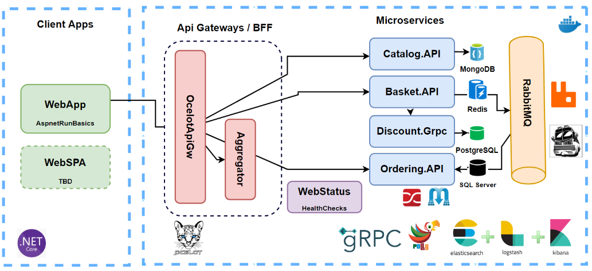

# ApsnetMicroservices

Construindo um projeto de Microservices. Esse projeto consiste em uma implementação feita no curso [Microservices Architecture and Implementation](https://www.udemy.com/course/microservices-architecture-and-implementation-on-dotnet/?couponCode=JULY23), com o objetivo de solidificar os conhecimentos em Microservices nas tecnologias citadas.




## Tecnologias Utilizadas

- .Net 6 usando Asp.Net Web API
- Docker
- RabbitMQ
- Ocelot API Gateway
- MongoDB
- Redis
- SqlServer

## Descrição

O projeto de microsserviços `bufa-microservices` é composto pelos seguintes microsserviços:

### Catalog microservice

- Aplicação ASP.NET Core Web API
- Princípios REST API
- Operações CRUD
- Banco MongoDB
- Implementação do padrão Repository Pattern
- Documentação da API com Swagger Open API

### Basket microservice

- Aplicação ASP.NET Web API
- Princípios REST API
- Operações CRUD
- Banco Redis
- Consumo do Serviço Discount Grpc Service para comunicação de sincronização entre serviços para calcular o preço final do produto
- Publica em uma fila do BasketCheckout usando o RabbitMQ com MassTransit

### Discount microservice 

- ASP.NET Grpc Server
- Crie uma comunicação gRPC entre serviços de alto desempenho com o Basket Microservice
- Expondo serviços Grpc com a criação de mensagens Protobuf
- Usando o Dapper para implementação de Micro ORM para simplificar o acesso aos dados e garantir alto desempenho
- Banco PostgreSQL para connection and containerization

### Ordering microservice 

- Implementando DDD, CQRS e Arquitetura Limpa com o uso de Melhores Práticas
- Crie uma comunicação gRPC entre serviços de alto desempenho com o Basket Microservice
- Expondo serviços Grpc com a criação de mensagens Protobuf
- Usando o Dapper para implementação de Micro ORM para simplificar o acesso aos dados e garantir alto desempenho
- Banco PostgreSQL para connection and containerization

### API Gateway Ocelot Microservice
- Implementação de uma API Gateways com Ocelot
- Exemplos de microsserviços/contêineres para redirecionar por meio dos API Gateways

### WebUI ShoppingApp Microservice
- Aplicação ASP.NET Core Web Application com Bootstrap 4 and Razor template

## Instalação

Siga estas etapas para configurar seu ambiente de desenvolvimento (Antes de executar, inicie o Docker Desktop):

1. Clone o repositório
2. No diretório raiz que inclui os arquivos docker-compose.yml e docker-compose.override.yml. Execute o seguinte comando:
```
docker-compose -f .\docker-compose.yml -f .\docker-compose.override.yml up -d
```
3. Aguarde até que o docker componha todos os microsserviços. É isso! (Alguns microsserviços podem precisar de tempo extra para funcionar, então aguarde se não funcionou no primeiro fechamento)
